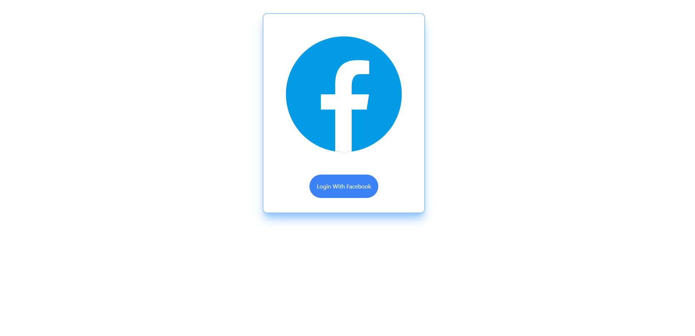
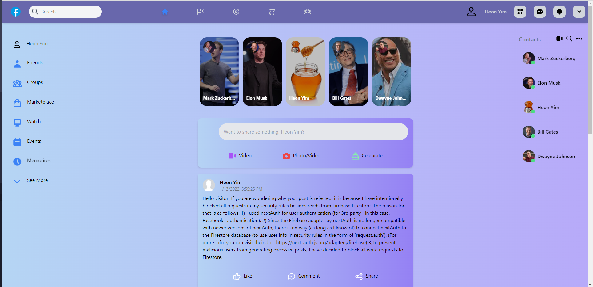

# Facebook Clone

## Introduction

This project is an attempt to clone the main page of Facebook using Next.js. This project aims to implement engaging UI with css transitions and a unique color theme.

 

 

## Technologies Used

- Next.js
- React.js
- Firebase Firestore & Storage
- TailwindCSS
- NextAuth

 

 

## Assets Used

- Heroicons

 

 

## Deployment 

I have hosted the application on vercel. You can visit the deployed application through the following link: [https://clone-1-gp5gdc6n6-12345120.vercel.app/](https://clone-1-gp5gdc6n6-12345120.vercel.app/)

 

 

## Notes

It will ask you to log in with your Facebook Account (OAuth login). After login, you will be directed to the main page. If you want to log out, you can click the person icon to the left of your Facebook name on the Navbar.

 

 

## Sources

This app is inspired by tutorial by [Sonny Sangha](https://www.youtube.com/watch?v=dBotWYKYYWc).